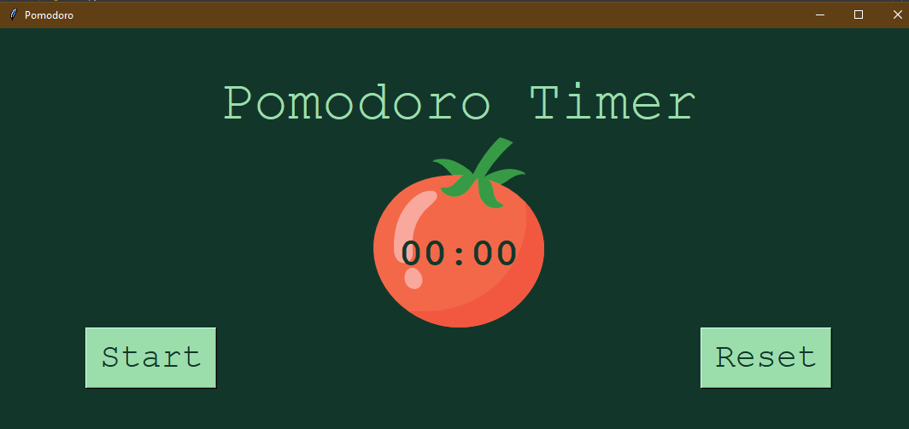

# Pomodoro Timer
A time that allows you to increase your workflow using the pomodoro technique

**Link to live website:** https://specialyas.github.io/Restaurant-Website/

## How It's Made:

**Tech used:** python
This site was built using the TKinter python library. The goal was create an app to help with productivity. 

## Optimizations
A backend could be added to accept and process payment on the site

## Lessons Learned:

